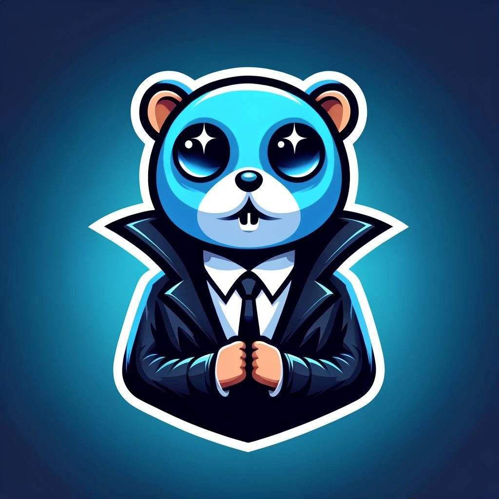

# Agency: The Go Way to AI Pipelines

Library designed for developers eager to explore the potential of Large Language Models (LLMs) and other generative AI through a clean, effective, and Go-idiomatic approach.

**Welcome to the agency!** 🕵️‍♂️



## 💻 Quick Start

Install package:

```bash
go get github.com/eqtlab/agency
```

Chat example:

```go
package main

import (
	"bufio"
	"context"
	"fmt"
	"os"

	_ "github.com/joho/godotenv/autoload"

	"github.com/neurocult/agency/core"
	"github.com/neurocult/agency/providers/openai"
)

func main() {
	assistant := openai.
		New(openai.Params{Key: os.Getenv("OPENAI_API_KEY")}).
		TextToText(openai.TextToTextParams{Model: "gpt-3.5-turbo"}).
		SetPrompt("You are helpful assistant.")

	messages := []core.Message{}
	reader := bufio.NewReader(os.Stdin)
	ctx := context.Background()

	for {
		fmt.Print("User: ")

		text, err := reader.ReadString('\n')
		if err != nil {
			panic(err)
		}

		input := core.NewUserMessage(text)
		answer, err := assistant.SetMessages(messages).Execute(ctx, input)
		if err != nil {
			panic(err)
		}

		fmt.Println("Assistant: ", answer)

		messages = append(messages, input, answer)
	}
}
```

That's it!

See [examples](./examples/) to find out more complex usecases including RAGs and multimodal pipelines.

## 🚀 Features

✨ **Pure Go**: fast and lightweight, statically typed, no need to mess with Python or JavaScript

✨ Write **clean code** and follow **clean architecture** by separating business logic from concrete implementations

✨ Easily create **custom pipes** by implementing simple interface

✨ **Compose pipes** together into **pipelines** with the ability to observe each step via **interceptors**

✨ **OpenAI API bindings** (can be used for any openai-compatable API: text to text (completion), text to image, text to speech, speech to text

<!-- TODO v0.1.0
- [ ] Name the organization
- [ ] Reorganize folders and packages -->

## 🤔 Why need Agency?

At the heart of Agency is the ambition to empower users to build autonomous agents. While **perfect for all range of generative AI applications**, from chat interfaces to complex data analysis, our library's ultimate goal is to simplify the creation of autonomous AI systems. Whether you're building individual assistant or coordinating agent swarms, Agency provides the tools and flexibility needed to bring these advanced concepts to life with ease and efficiency.

In the generative AI landscape, Go-based libraries are rare. The most notable is [LangChainGo](https://github.com/tmc/langchaingo), a Go port of the Python LangChain. However, translating Python to Go can be clunky and may not fit well with Go's idiomatic style. Plus, some question LangChain's design, even in Python. This situation reveals a clear need for an idiomatic Go alternative.

Our goal is to fill this gap with a Go-centric library that emphasizes clean, simple code and avoids unnecessary complexities. Agency is designed with a small, robust core, easy to extend and perfectly suited to Go's strengths in static typing and performance. It's our answer to the lack of Go-native solutions in generative AI.

## 🛣 Roadmap

In the next versions:

- [ ] Support for external function calls
- [ ] Metadata (tokens used, audio duration, etc)
- [ ] More provider-adapters, not only openai
- [ ] Image to text pipes
- [ ] Powerful API for autonomous agents
